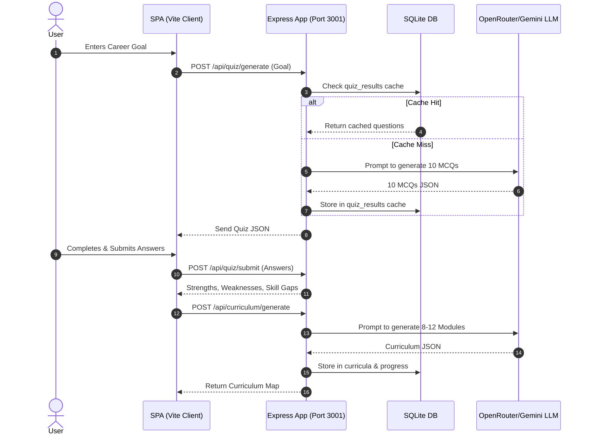

# Skill2Hire — Comprehensive Interview Preparation Guide

This guide is designed to help you ace your technical interviews by providing an in-depth, technical walkthrough of **Skill2Hire**'s architecture, core codebase mechanics, algorithms, and system design choices.

---

## 🧭 Table of Contents
1. [Core Project Overview](#1-core-project-overview)
2. [Full Technology Stack & Rationale](#2-full-technology-stack--rationale)
3. [Deep Technical Breakdown of Core Features](#3-deep-technical-breakdown-of-core-features)
4. [System Architecture & Data Flows](#4-system-architecture--data-flows)
5. [The LLM Pipeline & Token Optimization (System Design Focus)](#5-the-llm-pipeline--token-optimization-system-design-focus)
6. [Database Schema & Persistent Storage](#6-database-schema--persistent-storage)
7. [Client-Side Architecture (SPA & UI Mechanics)](#7-client-side-architecture-spa--ui-mechanics)
8. [Top 12 Interview Questions & Master Answers](#8-top-12-interview-questions--master-answers)

---

## 1. Core Project Overview

### What is Skill2Hire?
**Skill2Hire** is a gamified, AI-powered Single Page Application (SPA) designed to solve the **"educational-to-employment gap."** Instead of generic courses, it analyzes a user's career goals and current skill levels (leveraging LLMs for assessment), generates a custom learning curriculum, teaches the topics dynamically, and maps their actual acquired skills to live job matches using a server-side matching algorithm.

### Core Value Propositions:
- **Hyper-Personalization**: Adapts to arbitrary user goals (e.g., *"I want to build AI-driven agricultural drones"*).
- **Cost Efficiency**: Minimizes LLM usage costs using a multi-layered server-side database cache.
- **Immediate Feedback Loop**: Integrates real job placement potential based on skills learned, giving direct career motivation.
- **Engagement**: Uses an XP, leveling, streak-tracking, and badge-awarding gamification engine.

---

## 2. Full Technology Stack & Rationale

| Layer | Technology | Why This Choice? (Interview Rationale) |
|---|---|---|
| **Frontend** | **Vite + Vanilla JS** | Lightweight, avoids framework overhead (React/Vue) to demonstrate deep understanding of DOM manipulation, hash routing, state management, and Canvas animation APIs. |
| **Styling** | **Custom Vanilla CSS** | Implements CSS variables, glassmorphism UI, grid/flexbox layouts, responsive design, and CSS transitions without relying on large CSS utility libraries. |
| **Backend** | **Node.js + Express** | High concurrency with asynchronous I/O, ideal for streaming LLM responses using Server-Sent Events (SSE). |
| **Database** | **SQLite (better-sqlite3)** | Embedded, serverless, and fast. Provides zero-configuration persistence with synchronous API execution for high-speed local caching. |
| **AI API** | **OpenRouter API** | Offers unified access to multiple LLM providers. In production, we default to `google/gemini-2.0-flash-001` for high speed and cheap pricing. |
| **Syntax Highlighting** | **PrismJS** | Provides lightweight client-side syntax highlighting for code blocks generated inside dynamic learning modules. |

---

## 3. Deep Technical Breakdown of Core Features

### A. AI-Generated Dynamic Quiz Assessment
- **Trigger**: During onboarding, the user enters a goal. The backend invokes the LLM asking for exactly **10 multiple-choice questions (MCQs)** tailored to that goal, spanning beginner, intermediate, and advanced levels.
- **JSON Security**: The system uses custom prompt engineering to force a strict JSON format. On the backend, we run `parseJSON()` which strips markdown backticks, cleans trailing commas, and executes a regex search for `[...]` or `{...}` boundaries if basic parsing fails.
- **Evaluation**: The front-end renders these questions. Upon submission, the backend evaluates the user's answers against correct keys, updates their `quiz_results` entry, compiles a list of strengths/weaknesses, and identifies specific skill gaps.

### B. Skill Gap Analysis & Visualization
- **Skill Radar Chart**: We render a custom SVG-based radar chart using custom drawing math (calculating trigonometric points using $\sin(\theta)$ and $\cos(\theta)$ based on the number of skill dimensions).
- **Priority Gaps**: Compares required target skills against user score levels and prioritizes subjects where score gaps are largest.

### C. Streaming Lessons via Server-Sent Events (SSE)
- **Concept**: Generating a full lesson block (2,000+ words with code samples) from an LLM can take 15–30 seconds. To prevent user timeout and provide a premium, modern feel, we stream the content.
- **Mechanism**: The client initiates an SSE connection via `EventSource` (or a POST request reading the stream reader body). The Express server sets headers:
  ```http
  Content-Type: text/event-stream
  Cache-Control: no-cache
  Connection: keep-alive
  ```
  Chunks are pushed down the socket in real-time and rendered directly to the screen using a markdown compiler.
- **PrismJS Hook**: As text streams, we dynamically apply PrismJS syntax highlighting on code blocks when the stream completes.

### D. Job Matching Algorithm (Pure Algorithm)
- Instead of using a slow, expensive LLM call to match every job, we run a **hybrid matching algorithm**:
  1. **User Skill Extraction**: We compile a list of all skills the user has acquired (both from their onboarding current skills and skills learned from completed curriculum modules).
  2. **Job Post Generation**: The LLM generates relevant job profiles including their `requiredSkills` list.
  3. **Fuzzy Match Score**: The server iterates over each job and runs a fuzzy match of the user's skills against `job.requiredSkills`:
     - **Exact Match**: Direct string equality (e.g., `"React"` == `"React"`).
     - **Substring Match**: Case-insensitive substring verification (e.g., `"React"` in `"React Native"`).
     - **Word-Overlap Match**: Splits multi-word phrases and checks intersection (e.g., `"Machine Learning"` and `"Deep Learning"` share `"Learning"`).
  4. **Math**: $\text{Match \%} = \frac{\text{Matched User Skills}}{\text{Total Required Skills}} \times 100$.
  5. **Sort**: Sorted in descending order of matching percentage.

---

## 4. System Architecture & Data Flows

Here is how data traverses the client-server boundary:



---

## 5. The LLM Pipeline & Token Optimization (System Design Focus)

An interviewer will look for how you handle **latency, API failures, and production costs**.

### A. The LLM Client (`server/llm.js`)
It centralizes all API requests to OpenRouter. It exports two main functions:
- `chat()`: Performs synchronous requests and updates token logging.
- `streamChat()`: Handles streaming output via Server-Sent Events, piping chunks to the browser in real time.

### B. Resilience in JSON Parsing (`parseJSON()`)
LLMs often append markdown formatting (e.g. ` ```json ` tags) or trailing commas that break standard `JSON.parse()`. To bypass this:
1. Strip surrounding whitespace and backticks.
2. Replace trailing commas inside arrays/objects using regex: `text.replace(/,\s*([\]}])/g, '$1')`.
3. Try standard parse. If it fails, search for matching brackets (`[...]` or `{...}`) using regex index scanning and parse the isolated substring.
4. If parsing still fails, apply default fallback schemas to prevent server crashes.

### C. Multi-Layer Caching Strategy
To avoid re-querying the LLM for identical operations:
- **Curriculum Cache**: Cached in SQLite. Re-opening a generated dashboard loads curriculum modules instantly.
- **Lesson Content Cache (`lesson_cache` table)**: Streamed lessons are stored locally. Re-opening an already completed lesson reads from SQLite in **< 5ms** instead of triggering a **~5,000-token LLM transaction**.
- **Jobs Cache**: Prevents re-running matching and jobs generation query loops.

### D. Token Usage & Cost Logging
The `token_usage` table stores:
- `prompt_tokens`
- `completion_tokens`
- `total_tokens`
- `feature` (e.g., `quiz`, `lesson`, `curriculum`, `mentors`)

A SQL aggregation displays total spent costs on the dashboard, calculated using OpenRouter pricing structures ($0.075 / 1M input, $0.30 / 1M output tokens for Gemini Flash).

---

## 6. Database Schema & Persistent Storage

SQLite uses 8 tables linked to represent user profiles and learning states:

```
+-------------------------------------------------------------+
|                            USERS                            |
+-------------------------------------------------------------+
| id (PK) | name | email (UK) | goal | wants_project | ...   |
+-------------------------------------------------------------+
       |                  |                |            |
       | 1-to-1           | 1-to-1         | 1-to-1     | 1-to-many
+---------------+  +--------------+  +------------+  +--------------+
| QUIZ_RESULTS  |  |  CURRICULA   |  |  PROGRESS  |  | LESSON_CACHE |
+---------------+  +--------------+  +------------+  +--------------+
| user_id (FK)  |  | user_id (FK) |  | user_id    |  | user_id (FK) |
| questions_json|  | modules_json |  | level, xp  |  | module_index |
| score         |  | skill_gap    |  | badges_json|  | content      |
+---------------+  +--------------+  +------------+  +--------------+
                                            |
                                            | 1-to-1
                                     +---------------+
                                     | PROJECT_STEPS |
                                     +---------------+
                                     | user_id (FK)  |
                                     | project_json  |
                                     | current_step  |
                                     +---------------+
```

---

## 7. Client-Side Architecture (SPA & UI Mechanics)

Skill2Hire is a **Single Page Application (SPA)** written using vanilla JavaScript, highlighting pure client engineering:

1. **State Management**:
   - Holds user configuration, profile, and current routing context in a global state object (`main.js`).
   - Syncs session token and active `userId` inside `localStorage` to survive page reloads.

2. **Hash-Based Router**:
   - Listens to the `hashchange` browser event:
     ```javascript
     window.addEventListener('hashchange', router);
     ```
   - Matches window hash pattern (`#/dashboard`, `#/lesson/:id`) and dynamically renders the targeted view inside the central container (`#app`) without reloading the page.

3. **Performance Visuals**:
   - **Canvas Particle System**: Renders dynamic glowing lines in the background. It utilizes an HTML5 `<canvas>` element and custom vector mechanics (`x, y, vx, vy`) inside a `requestAnimationFrame` loop.
   - **Confetti Engine**: Native canvas draw calls that distribute gravity and velocity vectors over particles when XP thresholds trigger level-ups.

---

## 8. Top 12 Interview Questions & Master Answers

### Q1: Why did you choose a custom Single Page Application router using Vanilla JavaScript instead of React?
> **Answer:** "I wanted to avoid framework abstractions to highlight my core JavaScript proficiency. Writing a hash-based router from scratch using `window.addEventListener('hashchange')` and dynamic DOM replacement demonstrates my deep knowledge of the browser lifecycle, event bubbling, DOM layout reflows, and Client-Side Routing mechanics."

### Q2: How does the Server-Sent Events (SSE) streaming mechanism function under the hood?
> **Answer:** "For content-heavy endpoints like lessons and projects, waiting for a full response causes high latency. We use SSE by writing headers that keep the HTTP stream open (`Content-Type: text/event-stream`). The backend reads the stream from OpenRouter chunk-by-chunk and pipes the raw tokens directly to the client via `res.write()`. The frontend reads this stream line-by-line and appends it to the DOM immediately, reducing Time-to-First-Token (TTFT) from 15 seconds to under 400 milliseconds."

### Q3: How did you handle API failures or model timeouts in production?
> **Answer:** "We implemented three resilience mechanisms:
> 1. **Local Database Fallbacks**: If the LLM call fails, the router catches the exception and falls back to structural offline templates stored locally in SQLite.
> 2. **JSON Sanitization (`parseJSON`)**: If an LLM returns invalid characters, custom regex removes trailing commas and extracts JSON blocks via pattern matching.
> 3. **Input Validation**: Before generating lessons, we sanitize input strings on the server to prevent prompt injection."

### Q4: How is the skill gap analysis calculated and displayed?
> **Answer:** "The assessment quiz yields a score breakdown across required skills. We calculate the score gap by subtracting the user score from the target industry score. This is visualized on a custom SVG radar chart drawn dynamically using polar-to-cartesian coordinate conversion. The formula used is $x = \text{centerX} + r \cdot \cos(\theta)$ and $y = \text{centerY} + r \cdot \sin(\theta)$."

### Q5: How do you prevent cost overflow or excessive token usage?
> **Answer:** "First, we default to the cost-efficient `google/gemini-2.0-flash-001` model. Second, we cache outputs inside SQLite (`lesson_cache`, `jobs_cache`, `curricula`). Re-accessing a module loads it directly from the cache, completely eliminating token transactions. Third, we set a defensive `max_tokens` cap (2000 for standard queries, 2500 for stream modules) to prevent over-generation."

### Q6: Can you explain your SQLite schema design for this system?
> **Answer:** "The schema is relational, composed of 8 normalization tables (`users`, `progress`, `quiz_results`, `curricula`, `lesson_cache`, `project_steps`, `jobs_cache`, `token_usage`). Foreign keys connect to the primary `users` table. We use indices on `user_id` and unique constraints on `email` to maintain query optimization and referential integrity."

### Q7: How does your job matching algorithm calculate compatibility percentages without calling an LLM?
> **Answer:** "Using an LLM to dynamically score every job listing is slow and expensive. Instead, I built a server-side algorithm. We compile all skills the user has unlocked (via quiz score plus modules completed). Then, we perform substring, exact, and word-overlap checks against the job's `requiredSkills` list. The final score is: $\text{Match \%} = \frac{\text{matched skills}}{\text{required skills}} \times 100$. This results in a fast (sub-millisecond) match calculation."

### Q8: How does the onboarding flow handle custom or abstract goals?
> **Answer:** "The backend feeds the user's custom string directly into a dynamic LLM prompt context. The prompt instructs the model to dissect the career path, outline 5 necessary skill pillars, and formulate 10 custom MCQs. Because the LLM acts as the compiler, the platform can easily onboard highly non-traditional career objectives."

### Q9: How does the gamification engine calculate streaks?
> **Answer:** "When a user completes a lesson module, we evaluate their `last_active` timestamp in the database:
> - If the difference is between 20 and 48 hours, we increment the active streak counter.
> - If it is under 20 hours, we record progress but hold the streak count (to prevent daily spamming).
> - If it is over 48 hours, we reset the streak to 1."

### Q10: How did you implement syntax highlighting for streamed markdown text?
> **Answer:** "Because markdown arrives as raw text chunks, applying PrismJS highlighting continuously on broken code blocks is inefficient and buggy. Instead, we compile incoming markdown to HTML during the stream, and once the SSE connection emits the `done` event, we invoke `Prism.highlightAll()` on the completed code blocks."

### Q11: What is the benefit of using Vite in this project?
> **Answer:** "Vite provides extremely fast Hot Module Replacement (HMR) using native ES modules. In our setup, we configure Vite to proxy frontend API calls from port `5173` to our Express server running on port `3001` via `vite.config.js`. This allows us to separate frontend and backend developer modules during local staging, while avoiding CORS issues."

### Q12: How do you verify user authorization on backend routes?
> **Answer:** "Currently, authorization uses a lightweight session identifier: the client sends the active `userId` in request headers or body payloads, which the backend validates against the SQLite `users` table. In a production environment, this would scale to JSON Web Tokens (JWT) signed with a secure secret key, stored inside HttpOnly cookies to protect against XSS attacks."
